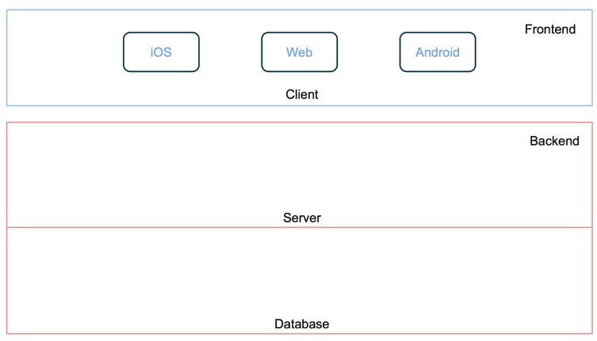
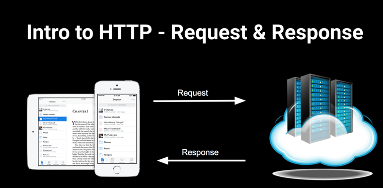
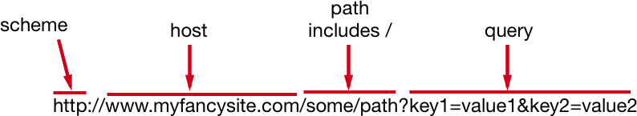

# W6D1-Lighthouse-Lecture

* Servers
* URL Basics
* URL Encoding
* HTTP Methods & REST
* User/Push Notification
* REST Requests For Today’s Assignment


## Servers



* Servers are ordinary computers that run applications on a network.



* Servers listen to a specific port. Clients (websites, desktop apps, mobile apps, etc.) make requests that are received through a port. Servers do work and respond to these requests.

* Servers and clients on the internet usually communicate using the HTTP protocol (there are other protocols such as FTP, WebSocket, etc.)

* Web servers host web resources, such as HTML, PDF, JSON, image data, etc.

* Client applications request these resources through the server.

* Resources can be either static or dynamic. 

* Dynamic resources are created/assembled by the web server's application on the fly often involving help from still more servers.

* Servers send a response back to the client with the resource if it could fulfill the request, otherwise it will give some information about what went wrong with processing the request.

#### Basic HTTP Status Codes: 

2XX => Successful

3XX => Redirection

4XX => Bad Request (Syntax error)

5XX => Server Error


* [Status Code Definitions](http://www.w3.org/Protocols/rfc2616/rfc2616-sec10.html)

* Once the response is sent, the server closes the connection and doesn't track anything about the client. 
* The HTTP protocol is said to be "stateless" because of this. 
* If the client sends the same request again, the server treats it as a brand new request from a brand new client. 

* One request/response cycle is called a "transaction".



## URI's

* Uniform Resource Identifier
* "A URL is simply a URI that happens to point to a resource over a network" [wikipedia](https://en.wikipedia.org/wiki/Uniform_Resource_Identifier)
* Use URLComponents: 

```swift
var components = URLComponents(string: "http://mycoolsite.com")
components?.path = "/my/path"
let queryItem1 = URLQueryItem(name: "name", value: "Fred Flintstone")
let queryItem2 = URLQueryItem(name: "password", value: "123")
components?.queryItems = [queryItem1, queryItem2]
components?.url // http:mycoolsite.com/my/path/?key1=value
components?.query
components?.queryItems

// Read it
components?.scheme // http
components?.host // http://mycoolsite.com
components?.path // /my/path
components?.queryItems?.count // 1
components?.queryItems![0].name // "name"
components?.queryItems![0].value // "Fred"

// adding some spaces to the path
components?.path = "/path with space"
components?.url // http://mycoolsite.com/path%20with%20space?name=Fred&password=123
```

## URL Encoding

* You’ve probably come across %20 in urls.
* URL encoding converts characters into a format that can be transmitted over the net.
* Only a delimited subset of ASCII characters can be included in a url.
* These are A-Z a-z 0-9 and $ - . + ! * ‘ ( ) , and some reserved characters like : //
* If a url just uses the accepted ASCII characters it can be used unencoded.
* Encoding replaces unsafe ASCII characters with % followed by 2 hex digits.
* URL's can’t contain spaces or anything not in the ASCII subset.
* These must be encoded.
* CocoaTouch takes care of encoding when we create URLs.

## HTTP Protocol Request Methods & REST

* The http protocol has a bunch of request methods.
* The most common are GET and POST, but there are others.
* Here are the most important ones:

**GET => Retrieves data<br>
POST => Sends data (e.g. sending web forms)<br>
HEAD => Same as GET but no response body<br>
PUT => Modifies existing resource (update)<br>
DELETE => Deletes!**<br>

* REST is a very common architecture/style of exposing an application sitting on a server. 

* It’s currently the dominant style of exposing a web backend.

* REST mimics the HTTP protocol and uses the same request methods, but don’t confuse the 2.

* You could, as an experiment, use a REST architecture on a data manager object to handle core data. This would involve sending an NSURL that the manager would parse to determine how to do the data call. eg. “myapp://steve.com/users” could be parsed so that it returns all users if it’s a GET request. eg. “myapp://steve.com/users/:id” would get a specific user. REST is just a style/convention for exposing an API for request/response interactions.

## iOS Push Notifications

* So we've heard about NSNotificationCenter which uses the Observer Design Pattern to broadcast data from the system to your code in a completely decoupled way. The class used for this is called NSNotificationCenter. 

* There is also a system on iOS of user notifications.  Don't confuse the 2.

* User notifications enable an app that is no longer running to alert the user about some event. 

* Eg. Let's say the user setup a calendar event inside your app. User notifications can alert the user of this event even if your app is not running.

* User notifications can be used to pass the user a message. For instance, an impending calendar event, timer event, location geofencing event, or some important data change on a remote server.

* There are 2 types of user notifications on iOS: local and remote.

* User Notifications can display alerts, and play default or custom sounds to the user, as well as badge the app icon with a number. 

* When the app is in the foreground there are no alerts/sounds/badging by default, but it is easy to implement.

* Local and remote notifications look and sound the same from the user's point of view.

* User's can tap to launch the app from the notification or ignore them.

* Local notifications are scheduled and sent by the app itself (no internet needed).

* Remote notifications (aka Push Notifications) originate on a remote server that you manage (or it could be a push service) and are pushed on a user's device via Apple's Push Notification Service APNs. 

* Your server calls APNs and their service calls the associated device and passes the data securely.

* For remote notifications, your server environment must be capable of receiving data from user devices and sending notification-related data to APNs.

* Most BAAS systems also include push notification support.


* There are 2 Notification API's. `UILocalNotifictions`, and the new system called `UNUserNotifications`. 

* `UNUserNotifications` was introduced in iOS 10. So, you might need to use both API's in an app that is backward compatible. :(

* `UNUserNotifications` is way more powerful. (It goes without saying, prefer current API's over legacy ones). 

* Setting up remote notifications is very involved. So, I won’t be demoing that today. But we can learn the basics by looking at an example of a local notification.

# =>Demo LocalNotification<=

*  [Documentation Link](https://developer.apple.com/library/prerelease/content/documentation/NetworkingInternet/Conceptual/RemoteNotificationsPG/Chapters/Introduction.html#//apple_ref/doc/uid/TP40008194)

#### The steps for configuring a local notification are as follows:

1. Create and configure a `UNMutableNotificationContent` object with the notification details.
2. Create a `UNCalendarNotificationTrigger`, `UNTimeIntervalNotificationTrigger`, or `UNLocationNotificationTrigger` object to describe the conditions under which the notification is delivered.
3. Create a `UNNotificationRequest` object with the content and trigger information.
4. Call the `addNotificationRequest:withCompletionHandler:` method to schedule the notification.

## Rest Requests & Today’s Assignment

* Today’s assignment requires doing some REST requests.
* You can test the requests in terminal using CURL or you can use a REST Client.
* I’d like to just go over some of the requests using a REST client.
* The client I’m using in the demo today is Paw (Highly recommended). You can download a 30 day trial here if you want to follow along: [Paw](https://paw.cloud)
* There are many other clients. Here’s are 2 free ones: 1. [Rested](https://itunes.apple.com/ca/app/rested-simple-http-requests/id421879749?mt=12), 2. [PostMan Chrome Plugin](https://chrome.google.com/webstore/detail/postman/fhbjgbiflinjbdggehcddcbncdddomop?hl=en)

# =>Demo REST<=

